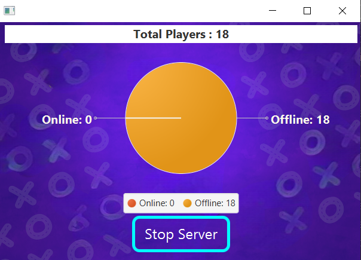

# TicTacToeServer

## Network Tic-Tac-Toe Server

### Description

Welcome to **TicTacToeServer**! This project implements a network-based Tic-Tac-Toe Sever using Java. It allows multiple players to connect and play against each other over a network, providing an interactive and engaging gaming experience.  

### Server Features

- **Database Management**:  
  The server handles all database transactions, ensuring secure and efficient storage and retrieval of user data.

- **Connection Handling**:  
  Manages connections between multiple clients to enable smooth and reliable communication.

- **Data Exchange**:  
  Facilitates seamless exchange of data, such as game states, user profiles, and messages, among connected users.

- **Simple GUI**:  
  A user-friendly interface is provided to manage server operations with ease.

- **Service Control**:  
  Includes **Start** and **Stop** buttons in the GUI to enable or disable the server service conveniently.

- **User Statistics**:  
  Displays real-time graphs showing:
  - The number of **active users**.
  - The number of **online users**.
  - The number of **offline users**.

---

## Screenshots  
 

---

## How It Works  

### Setup Instructions  
1. **Install Java**: Make sure Java is installed on your machine.  
2. **Set Up an IDE**: Use an IDE like NetBeans or IntelliJ IDEA to load the project files.  
3. **Network Setup**: Ensure a proper network configuration for multiplayer functionality.  

---

## Technologies Used  
- JavaFX for the user interface and graphics.  
- Sockets Networking for online and multiplayer functionalities.  
- Derby Database for managing user data and scores.  

---

## Contributors  

- **[Zeyad Maamoun](https://github.com/zeyadmamoun)**
- **[Nadia Farid](https://github.com/NadiaFarid799)**  
- **[Suhaila Farahat](https://github.com/Suhaila-Farahat)**  
- **[Mahmoud Salah](https://github.com/mahmoud126d)**  
- **[Mohammed Hussien](https://github.com/MohammedHussien10)**

---

## Prerequisites  
- Java installed on your machine.  
- IDE (NetBeans).  
- Stable network setup for multiplayer functionality.  

---

Enjoy playing and exploring **Tic Tac Toe Game**! 🎮

